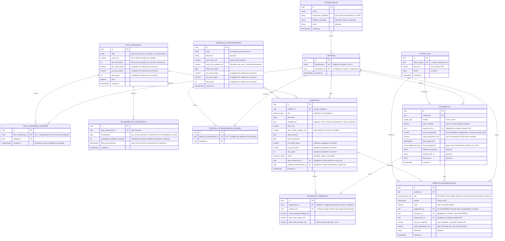

# ERD

```mermaid
erDiagram
    PROPRIETARIOS ||--o{ UNIDADES : possui
    UNIDADES ||--o{ TAXA_CONDOMINIO_UNIDADES : "vinculada em"
    TAXA_CONDOMINIO ||--o{ TAXA_CONDOMINIO_UNIDADES : vincula
    TAXA_CONDOMINIO ||--o{ FATURAMENTOS_COMPETENCIA : processa
    UNIDADES ||--o{ DESPESA_EXTRAORDINARIA_UNIDADES : participa
    DESPESAS_EXTRAORDINARIAS ||--o{ DESPESA_EXTRAORDINARIA_UNIDADES : rateia
    UNIDADES ||--o{ COBRANCAS : gera
    TAXA_CONDOMINIO |o--o{ COBRANCAS : origina
    DESPESAS_EXTRAORDINARIAS |o--o{ COBRANCAS : origina
    UNIDADES ||--o{ PAGAMENTOS : realiza
    COTACAO_BCV |o--o{ PAGAMENTOS : referencia
    PAGAMENTOS ||--o| PAGAMENTO_COBRANCAS : aloca
    COBRANCAS ||--o{ PAGAMENTO_COBRANCAS : recebe
    UNIDADES ||--o{ CREDITOS_MOVIMENTACOES : possui
    PAGAMENTOS |o--o{ CREDITOS_MOVIMENTACOES : gera
    COBRANCAS |o--o{ CREDITOS_MOVIMENTACOES : consome
    COTACAO_BCV |o--o{ CREDITOS_MOVIMENTACOES : referencia

    PROPRIETARIOS {
        uuid id PK
        string nome
        string documento_identidad "documento de identidade, ex CI/RIF"
        string telefone_whatsapp "opcional, contato p/ cobranca"
        string email "opcional"
        timestamptz created_at
    }

    UNIDADES {
        uuid id PK
        string identificacao UK "codigo da unidade, ex 22-11"
        uuid proprietario_id FK "1 unidade tem sempre 1 proprietario"
        timestamptz created_at
    }

    TAXA_CONDOMINIO {
        uuid id PK
        string titulo "plano de cobranca recorrente, ex Cuota Ordinaria"
        numeric valor_usd "valor mensal cobrado por unidade"
        int dia_vencimento "dia do mes, ajustado se o mes tiver menos dias"
        numeric pct_multa_atraso "congelado em cobrancas na emissao"
        numeric pct_juros_diario "congelado em cobrancas na emissao"
        int dias_graca "congelado em cobrancas na emissao"
        boolean ativo
        timestamptz created_at
    }

    TAXA_CONDOMINIO_UNIDADES {
        uuid id PK
        uuid taxa_condominio_id FK "N:N - unidade pode ter varias taxas simultaneas"
        uuid unidade_id FK
        timestamptz created_at "momento em que a unidade foi vinculada"
    }

    FATURAMENTOS_COMPETENCIA {
        uuid id PK
        uuid taxa_condominio_id FK "plano faturado"
        date competencia "dia 1 do mes faturado, ex 2026-08-01 (UK combinada com taxa)"
        int quantidade_unidades_faturadas "snapshot de quantas unidades receberam a cobrança"
        timestamptz data_processamento "data e hora exata do fechamento da competencia"
        timestamptz created_at
    }

    DESPESAS_EXTRAORDINARIAS {
        uuid id PK
        string titulo "ex Reparo do portao eletrico"
        string descricao "opcional"
        numeric valor_total_usd "valor total da despesa"
        numeric valor_por_unidade_usd "derivado: valor_total / unidades participantes"
        date data_vencimento
        numeric pct_multa_atraso "congelado em cobrancas na emissao"
        numeric pct_juros_diario "congelado em cobrancas na emissao"
        int dias_graca "congelado em cobrancas na emissao"
        timestamptz created_at
    }

    DESPESA_EXTRAORDINARIA_UNIDADES {
        uuid id PK
        uuid despesa_extraordinaria_id FK "N:N - unidades que ratearam essa despesa"
        uuid unidade_id FK
    }

    COBRANCAS {
        uuid id PK
        uuid unidade_id FK "sempre obrigatorio"
        cobranca_tipo tipo "ordinaria ou extraordinaria"
        string descricao
        date competencia "ordinaria = dia 1 do mes; extraordinaria = data_vencimento"
        numeric valor_usd
        numeric valor_credito_abatido_usd "parte quitada via credito da unidade"
        date data_emissao
        date data_vencimento
        numeric pct_multa_atraso "snapshot congelado na emissao"
        numeric pct_juros_diario "snapshot congelado na emissao"
        int dias_graca "snapshot congelado na emissao"
        cobranca_status status "pendente, pago ou cancelado"
        uuid taxa_condominio_id FK "obrigatorio se tipo=ordinaria, senao nulo"
        uuid despesa_extraordinaria_id FK "obrigatorio se tipo=extraordinaria, senao nulo"
        timestamptz created_at
    }

    COTACAO_BCV {
        uuid id PK
        date data_cotacao UK "1 cotacao oficial por dia"
        numeric tasa_ves "taxa VES por USD"
        string fuente "ex oficial"
        timestamptz created_at
    }

    PAGAMENTOS {
        uuid id PK
        uuid unidade_id FK
        moeda_tipo moeda "USD ou VES"
        numeric valor_recebido "valor na moeda original recebida"
        uuid cotacao_bcv_id FK "obrigatorio so quando moeda=VES"
        numeric tasa_bcv_aplicada "taxa congelada no pagamento, so quando moeda=VES"
        numeric valor_equivalente_usd "valor convertido pra USD nesse momento"
        timestamptz data_pagamento
        forma_pagamento_tipo forma_pagamento "pago_movil, transferencia, efectivo_usd, zelle"
        string referencia_bancaria "opcional"
        string comprovante_url "opcional"
        string observacao "opcional"
        timestamptz created_at
    }

    PAGAMENTO_COBRANCAS {
        uuid id PK
        uuid pagamento_id FK "UNIQUE - 1 pagamento quita no maximo 1 cobranca"
        uuid cobranca_id FK "1 cobranca pode receber varios pagamentos parciais"
        numeric valor_principal_abatido_usd
        numeric valor_juros_pago_usd
        numeric valor_total_alocado_usd "coluna gerada: principal + juros"
    }

    CREDITOS_MOVIMENTACOES {
        uuid id PK
        uuid unidade_id FK
        movimentacao_tipo tipo "ENTRADA (sobra/credito manual) ou SAIDA (consumo p/ abater cobranca)"
        moeda_tipo moeda "USD ou VES"
        numeric valor "valor na moeda original"
        uuid pagamento_id FK "so em ENTRADA vinda de sobra de pagamento, opcional"
        uuid cobranca_id FK "obrigatorio em SAIDA, nulo em ENTRADA"
        uuid cotacao_bcv_id FK "obrigatorio so quando moeda=VES"
        numeric tasa_bcv_aplicada "taxa congelada, so quando moeda=VES"
        numeric valor_equivalente_usd "valor convertido pra USD nesse momento"
        string descricao "opcional"
        timestamptz created_at
    }
```
